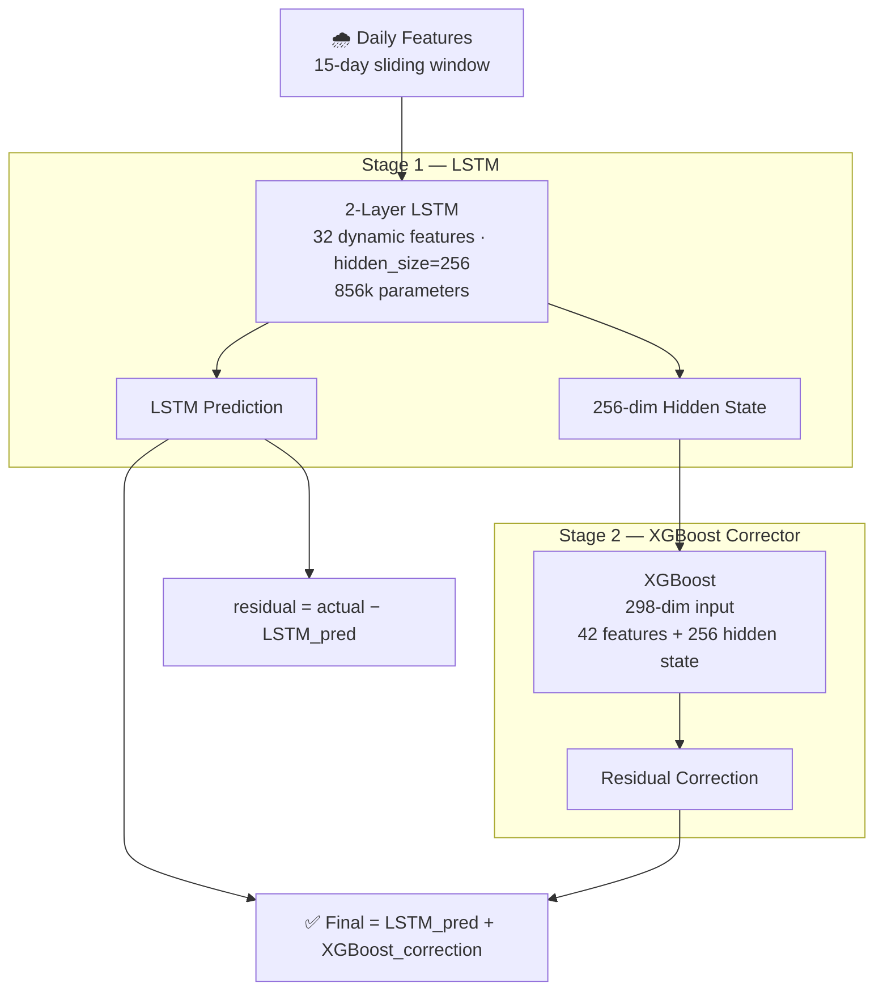
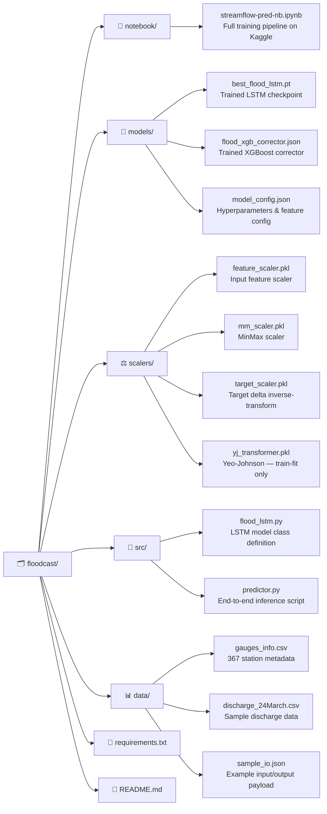

# 🌊 floodcast

> A two-stage hybrid ML pipeline for daily riverine streamflow forecasting,
> built toward real-time flood early warning across 367 river basins.

---

## What This Is

Most rivers are boring 95% of the time. A flood peak the kind that displaces communities and costs lives is statistically rare. That's the core problem with training a single neural network on river data: it learns to be "average-correct" and consistently undershoots the extreme events that actually matter.

**floodcast** solves this with a residual learning architecture:
- A **2-layer LSTM** learns the temporal rhythm of each river from 15-day sequences of rainfall, soil saturation, and upstream flow signals
- An **XGBoost corrector** then sees exactly what the LSTM got wrong and fixes it using physical basin geography slope, land cover, upstream area, routing lags

The result: NSE improves from **0.43 → 0.92** on the streamflow delta prediction task. All 367 test stations achieve NSE > 0.96.

---

## Results

| Metric | LSTM Only | Hybrid LSTM + XGBoost |
|---|---|---|
| NSE (delta target) | 0.4265 | **0.9227** |
| RMSE (delta) | 0.8663 | **0.3180** |
| MAE (delta) | 0.2356 | **0.0564** |
| Raw Flow NSE | — | **0.9996** |
| KGE | — | **0.9993** |
| Median per-station NSE | — | **0.9990** |
| Worst station NSE | — | **0.9669** |
| Flood peak error (PPE, top 5%) | — | **0.69%** |

---

## Architecture

---

## Dataset

---

## Features (50+)

| Category | Examples |
|---|---|
| Rainfall | `rainfallmmlog`, `rainfallmmlogdelta`, `upstreamrainmeanyj` |
| Antecedent moisture | `antecedentrain3/7/15/30dsum`, `antecedentrainEWM`, `soilsaturationScore` |
| Upstream flow | `upstreamweightedStreamflowlog`, `upstreamlag1/2streamflowlogdelta` |
| Seasonal | `monthsin/cos`, `doysin/cos`, `monsoonintensity`, `monsooncumulativerain` |
| Physical basin | `UPAREAyj`, `slpdg`, `forpc`, `urbpc`, `DISTSINK` |
| Routing | `upstreamlag1/2days`, `flowvelocitykmperday`, `attenuationfactor` |
| Interactions (YJ) | `rain×slope`, `rain×urban`, `rain×basinSize`, `UPAREA×upstreamRain` |

All Yeo-Johnson transformers are **fit exclusively on the training set** to prevent data leakage.

---

## Training Details

| Component | Config |
|---|---|
| Optimizer | AdamW (`lr=2e-3`, `weight_decay=1e-3`) |
| LR Schedule | OneCycleLR (30% warmup → cosine decay) |
| Loss | Composite: 60% Huber (δ=1.0) + 40% MAE, inverse-magnitude weighted |
| Precision | Mixed precision (AMP) |
| Gradient clipping | max norm = 1.0 |
| Early stopping | patience = 10 (after warmup) |
| Hardware | 2× Tesla T4 GPU, DataParallel |
| LSTM best epoch | Epoch 4 / 16 |
| XGBoost best iteration | 313 / 1000 |

---

## Per-Regime Performance

| Regime | Rows | LSTM NSE | Hybrid NSE | Gain |
|---|---|---|---|---|
| Baseflow (delta < 0.5) | 547,109 | −0.030 | 0.898 | **+0.928** |
| Rising (0.5–2.0) | 68,693 | 0.423 | 0.982 | **+0.558** |
| Flood peak (delta > 2.0) | 26,962 | 0.417 | 0.915 | **+0.498** |

## Project Structure

---

## Roadmap

- [x] LSTM baseline for streamflow delta forecasting
- [x] XGBoost residual corrector (two-stage hybrid)
- [x] Extended hydrological evaluation (KGE, LogNSE, PBIAS, PPE)
- [x] Per-station and per-regime performance breakdown
- [ ] Google Earth Engine integration for live satellite data
- [ ] Real-time inference pipeline
- [ ] Flood alert threshold dashboard

---

## Stack

`Python` · `PyTorch` · `XGBoost` · `HydroATLAS` · `Pandas` · `NumPy` · `Scikit-learn` · `Kaggle (2× T4 GPU)`

---

*Built as part of an ongoing project toward real-time riverine flood early warning.*
